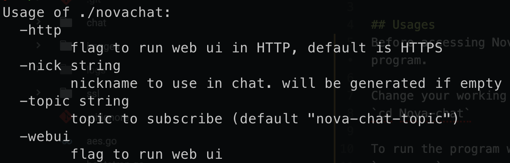
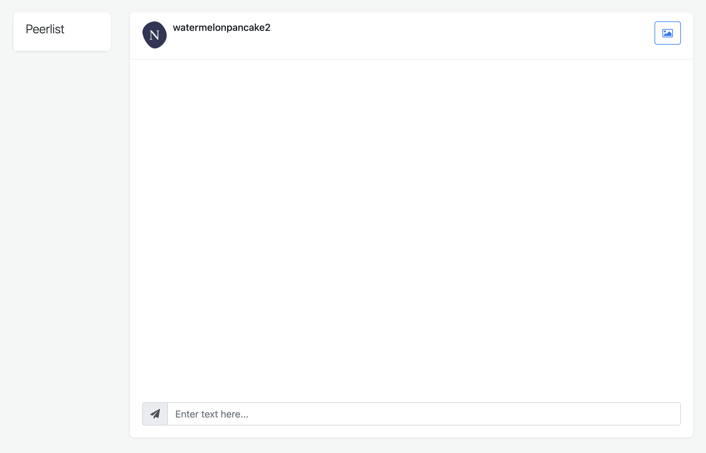
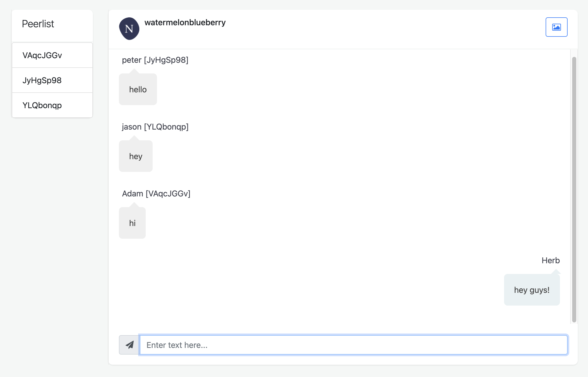
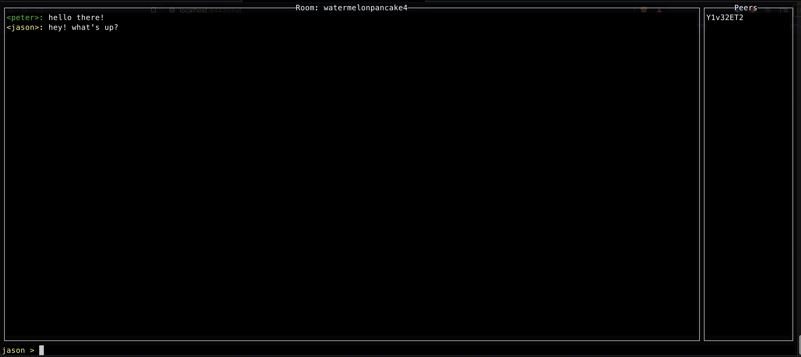

# Nova-chat

## IPFS-Based Chat using Gossipsub Protocol

## Usages
Before accessing NovaChat features, you can either run or build the program. You can read more about it here: https://blog.devgenius.io/go-build-vs-go-run-baa3da9715cc

### Change working directory
Change your working directory to Nova-chat project directory: 
`cd Nova-chat`

### Running the program
To run the program with default parameters, use the following command: 
`go run .`

### Building the program
To build and run the program, output to *novachat*: 
`go build -o novachat`  
`./novachat`

### Showing help menu
To show parameters: 
`go run . -h`  

## Advanced Usage

### Running with custom nickname
To run the program with a custom nickname of *Jason Bourne*: 
`go run . -nick=JasonBourne`

### Running with custom topic name
To run the program with a custom topic name of *watermelonbananas*: 
`go run . -topic=watermelonbananas`

### Running with HTTP (only for web-ui, HTTP instead of HTTPS)
`go run . -http`

## Novachat user interfaces (UI)
Novachat offers 2 user interfaces, one terminal-based and one web-based.

### Web-UI
The web interface can be run using the following command: 
`go run . --webui`
#### Default Webpage

#### Webpage with peers

### Terminal-UI
The terminal interface (default) can be run using the following command: 
`go run .`

