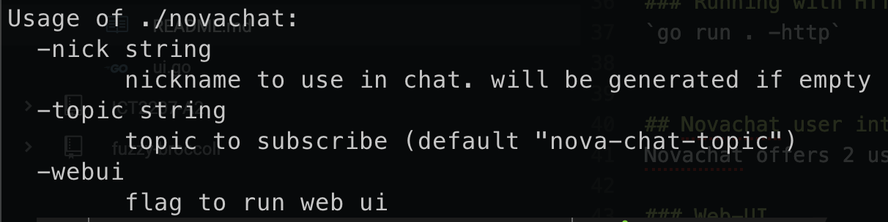

# Nova-chat
## IPFS-Based Chat using Gossipsub Protocol

## Usages
Before accessing NovaChat features, you can either run or build the program. You can read more about it here: https://blog.devgenius.io/go-build-vs-go-run-baa3da9715cc

Change your working directory to Nova-chat project directory:  
`cd Nova-chat`

To run the program with default paramters, use the following command:  
`go run .`

To build and run the program, output to "novachat":  
`go build -o novachat`  
`./novachat`

To show parameters:  
`go run . -h`  

